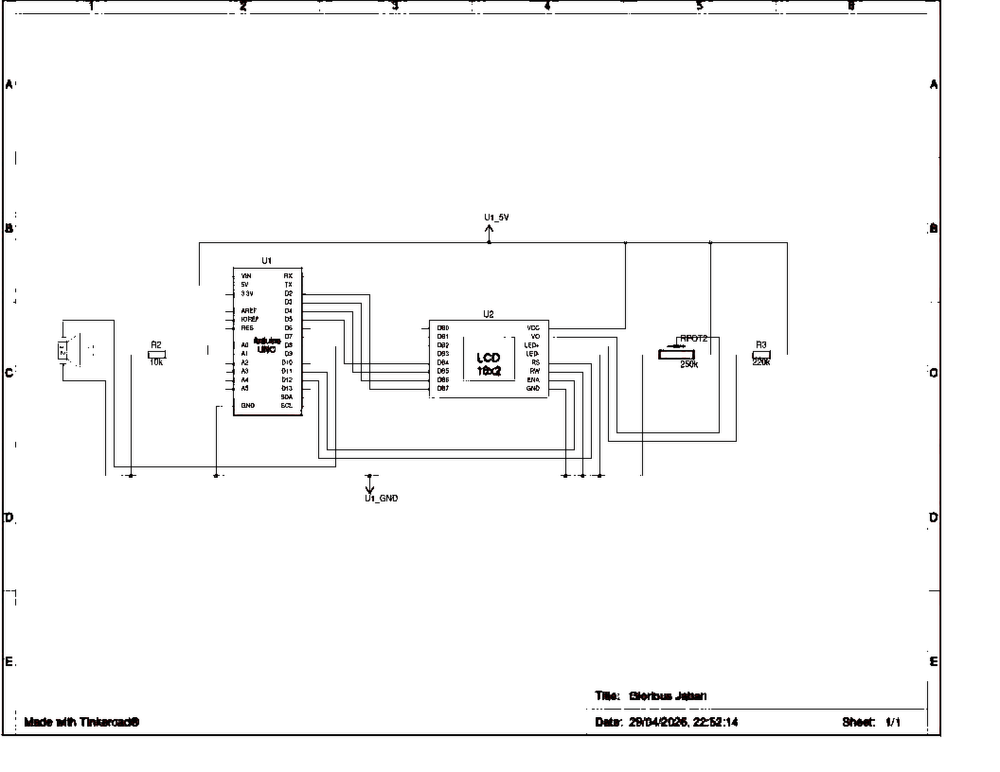

# ⚡ Medidor de Tensão com Arduino UNO

> Trabalho de Conclusão de Curso — Instituto Técnico Educacional Mirian Menchini (ITEMM)  
> Automatização de Processos de Medição Utilizando Arduino

---

## 📋 Descrição

Sistema de medição de tensão elétrica desenvolvido com **Arduino UNO** para monitoramento de placas eletrônicas durante testes operacionais. O equipamento exibe a tensão medida em tempo real em um **display LCD 16x2** e aciona automaticamente um **buzzer** de alerta sonoro sempre que a tensão ultrapassar **1,0 V**.

---

## 🔧 Componentes

| Componente | Especificação |
|---|---|
| Microcontrolador | Arduino UNO (ATmega328P) |
| Display | LCD 16x2 |
| Buzzer | Ativo 5V |
| Potenciômetro | 250 kΩ (contraste do LCD) |
| Resistor | 10 kΩ (entrada analógica) |
| Resistor | 220 Ω (backlight do LCD) |
| Cabos | Jumper macho-macho |
| Estrutura | Case personalizado impresso em 3D (PLA) |

---

## 🔌 Conexões

```
LCD RS   → D12
LCD E    → D11
LCD D4   → D5
LCD D5   → D4
LCD D6   → D3
LCD D7   → D2
LCD VO   → Potenciômetro 250 kΩ (contraste)
LCD LED+ → Resistor 220 Ω → 5V
Buzzer   → D8
Sensor   → A0  (tensão a medir, máx. 5V)
```

---

## 💻 Firmware

Desenvolvido em **C/C++** na Arduino IDE. O loop principal executa as seguintes etapas a cada 100 ms:

1. Leitura analógica via `analogRead(A0)`
2. Conversão para volts: `tensao = leitura * (5.0 / 1023.0)`
3. Atualização do display LCD
4. Verificação do limiar: se `tensao > 1.0V` → buzzer `HIGH`, caso contrário → `LOW`

---

## 📐 Esquema Elétrico



> Esquema desenvolvido na plataforma **Tinkercad**.

---

## 📊 Princípio de Funcionamento

O ADC de **10 bits** do Arduino UNO converte o sinal analógico de entrada (0–5V) em um valor inteiro de **0 a 1023**, com resolução de aproximadamente **4,88 mV por passo**.

A fórmula de conversão utilizada é:

```
V = leitura × (5,0 / 1023,0)
```

---

## 💰 Custo do Projeto

| Configuração | Custo Estimado |
|---|---|
| Componentes originais | R$ 167,00 |
| Componentes alternativos | R$ 63,50 |

---

## 🚀 Evolução Futura

A próxima versão do projeto prevê:

- Integração com módulo Wi-Fi **ESP8266 / ESP32**
- Transmissão automática das leituras para um **servidor remoto**
- Registro dos dados a cada **1 hora**
- Geração automática de **relatórios PDF** com histórico completo das medições

---

## 🛠️ Como usar

1. Clone este repositório ou baixe os arquivos
2. Abra `medidor_tensao.ino` na **Arduino IDE**
3. Monte o circuito conforme o esquema elétrico
4. Faça o upload para o Arduino UNO via USB
5. Conecte o pino A0 ao ponto do circuito a ser medido (máx. 5V)

> ⚠️ **Atenção:** Para medir tensões acima de 5V é necessário um divisor de tensão externo. O pino analógico do Arduino suporta no máximo 5V.

---


